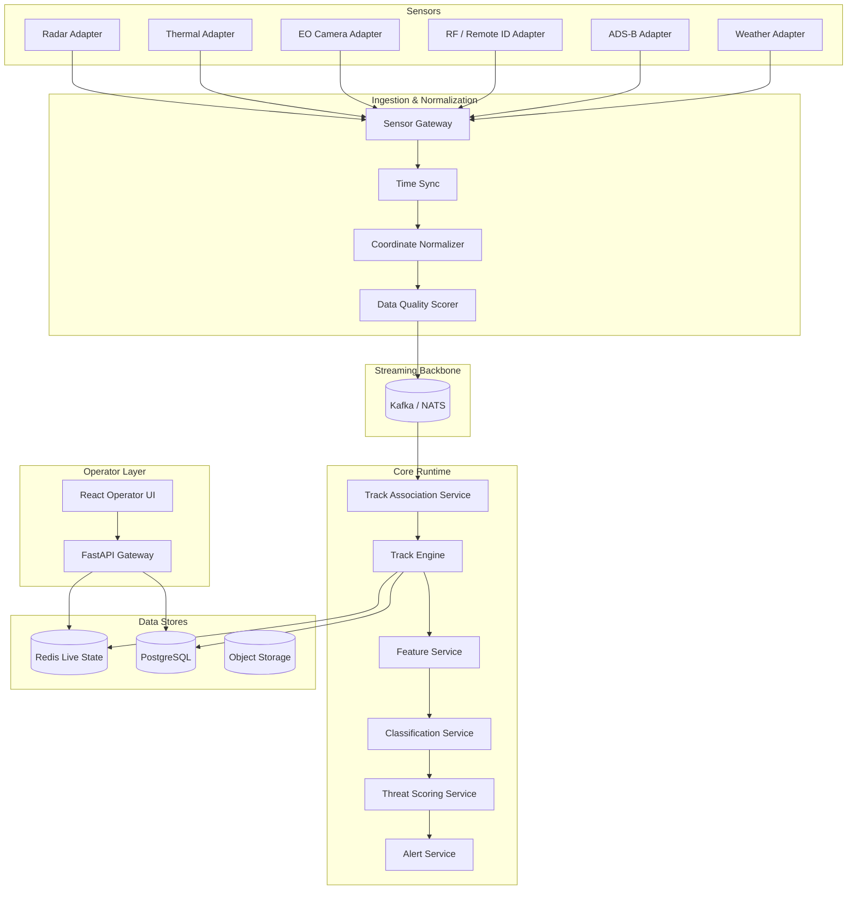
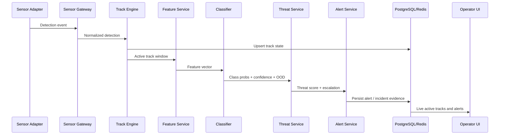

# Architecture

## High-level flow

```mermaid
flowchart TD
    subgraph Sensors
        RAD[Radar Adapter]
        THM[Thermal Adapter]
        EO[EO Camera Adapter]
        RF[RF / Remote ID Adapter]
        ADSB[ADS-B Adapter]
        WX[Weather Adapter]
    end

    subgraph EdgeIngest[Ingestion & Normalization]
        GW[Sensor Gateway]
        TS[Time Sync]
        CN[Coordinate Normalizer]
        DQ[Data Quality Scorer]
    end

    subgraph Stream[Streaming Backbone]
        K1[(Kafka / NATS)]
    end

    subgraph Core[Core Runtime]
        TA[Track Association Service]
        TE[Track Engine]
        FS[Feature Service]
        CLS[Classification Service]
        TH[Threat Scoring Service]
        AL[Alert Service]
    end

    subgraph Stores[Data Stores]
        REDIS[(Redis Live State)]
        PG[(PostgreSQL)]
        OBJ[(Object Storage)]
    end

    subgraph UI[Operator Layer]
        API[FastAPI Gateway]
        WEB[React Operator UI]
    end

    RAD --> GW
    THM --> GW
    EO --> GW
    RF --> GW
    ADSB --> GW
    WX --> GW

    GW --> TS --> CN --> DQ --> K1

    K1 --> TA --> TE
    TE --> REDIS
    TE --> PG
    TE --> FS
    FS --> CLS
    CLS --> TH
    TH --> AL

    API --> REDIS
    API --> PG
    WEB --> API
```

## Runtime sequence

```mermaid
sequenceDiagram
    participant S as Sensor Adapter
    participant G as Sensor Gateway
    participant T as Track Engine
    participant F as Feature Service
    participant C as Classifier
    participant H as Threat Service
    participant A as Alert Service
    participant DB as PostgreSQL/Redis
    participant UI as Operator UI

    S->>G: Detection event
    G->>T: Normalized detection
    T->>DB: Upsert track state
    T->>F: Active track window
    F->>C: Feature vector
    C->>H: Class probs + confidence + OOD
    H->>A: Threat score + escalation
    A->>DB: Persist alert / incident evidence
    DB->>UI: Live active tracks and alerts
```
